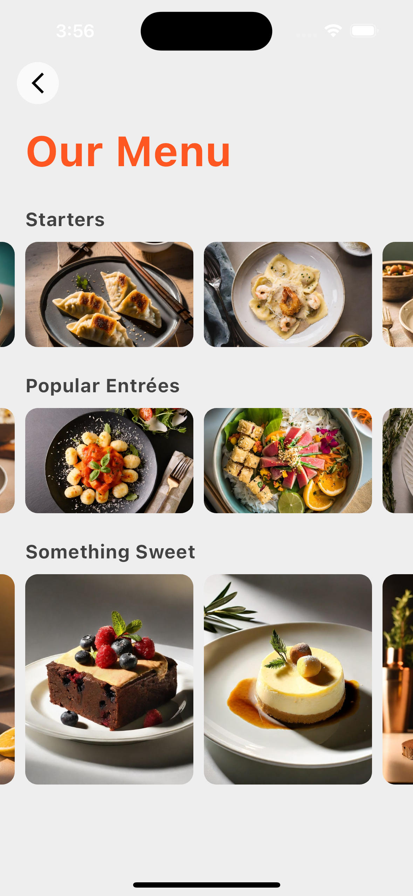
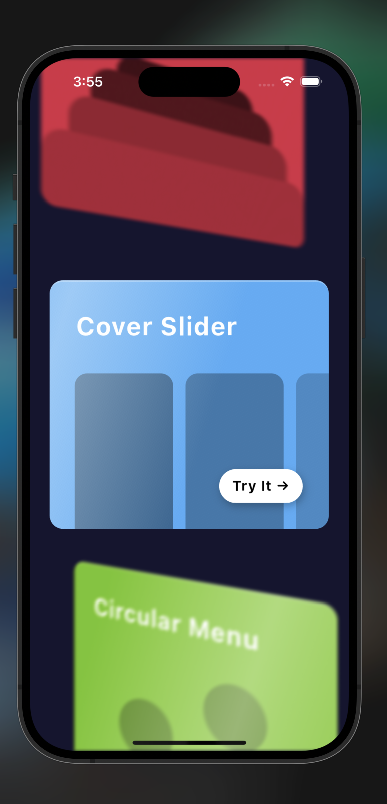
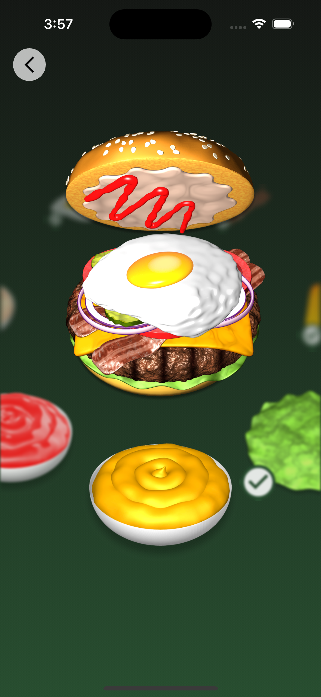
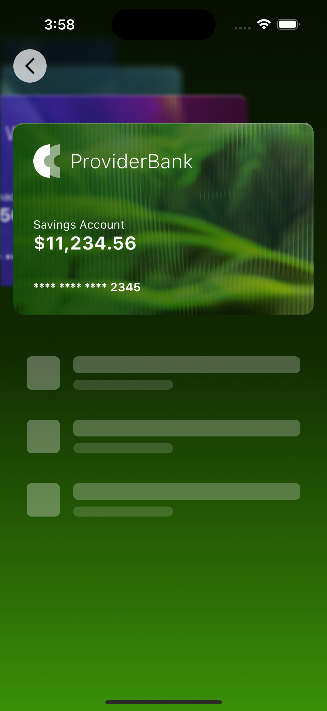
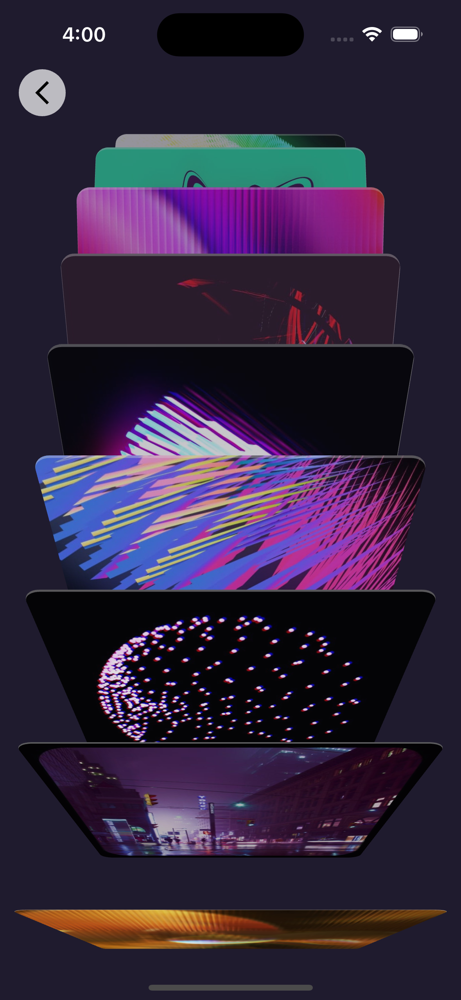
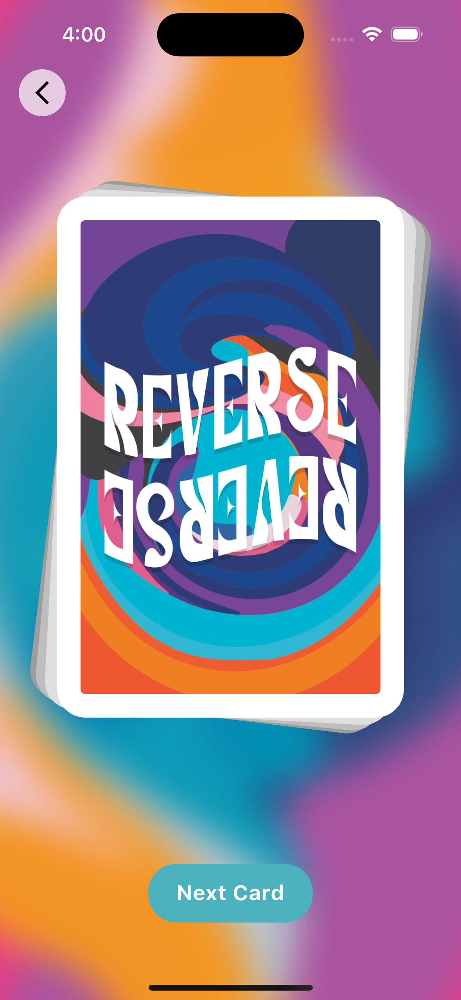

# flutter_custom_carousel_demo

A new Flutter project.

## Getting Started

This project is a starting point for a Flutter application.

A few resources to get you started if this is your first Flutter project:

- [Lab: Write your first Flutter app](https://docs.flutter.dev/get-started/codelab)
- [Cookbook: Useful Flutter samples](https://docs.flutter.dev/cookbook)

For help getting started with Flutter development, view the
[online documentation](https://docs.flutter.dev/), which offers tutorials,
samples, guidance on mobile development, and a full API reference.
## Screenshots
<!-- 

<tr>
    <td style="text-align: center;">
      

        
<a href="lib/108_animated_builder/animated_builder.dart" target="_blank">AnimationBuilder</a>

      

    </td>
    <td style="text-align: center;">
      

        
      

    </td>
  </tr>
   
   
   
   
   
   
 -->
<table align="center" style="margin: 0px auto;">
  <tr>
    <td style="text-align: center;">
      

        
        
<a href="lib/views/cover_slider_view.dart" target="_blank">CoverSliderView</a>

      

    </td>
    <td style="text-align: center;">
      

        
        
<a href="lib/views/cover_slider_view.dart" target="_blank">Cover Slider View</a>

      

    </td>
    <td style="text-align: center;">
      

        
        
<a href="lib/views/circular_menu_view.dart" target="_blank">Circular View</a>

      

    </td>
    <td style="text-align: center;">
      

        
        
<a href="lib/views/digital_wallet_view.dart" target="_blank">Digital Card</a>

      

    </td>
    <td style="text-align: center;">
      

        
        
<a href="lib/views/record_box_view.dart" target="_blank">Record Box</a>

      

    </td>  
    <td style="text-align: center;">
      

        
        
<a href="lib/views/card_deck_view.dart" target="_blank">Card Deck</a>

      

    </td>
  </tr>
</table>

## Navigation Instructions

To view a particular image, click on the corresponding image above. This will open the image in your browser or image viewer.

To navigate to a specific file:
- For Windows users: Right-click on the image and select "Open link in new tab" to view the file directly.
- For macOS users: Control-click on the image and select "Open link in new tab" to view the file directly.

Alternatively, you can navigate to the `assets` folder in this repository and find the image file by its name.
